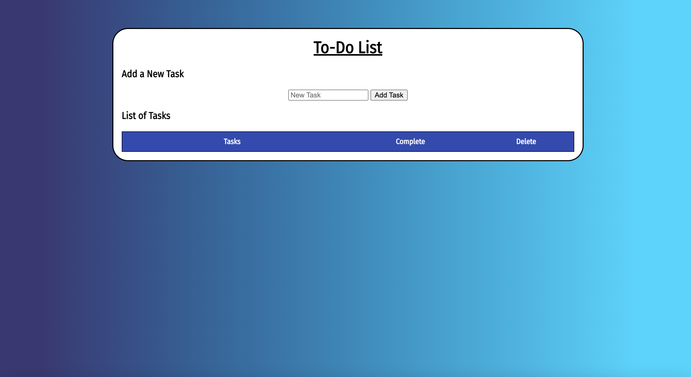
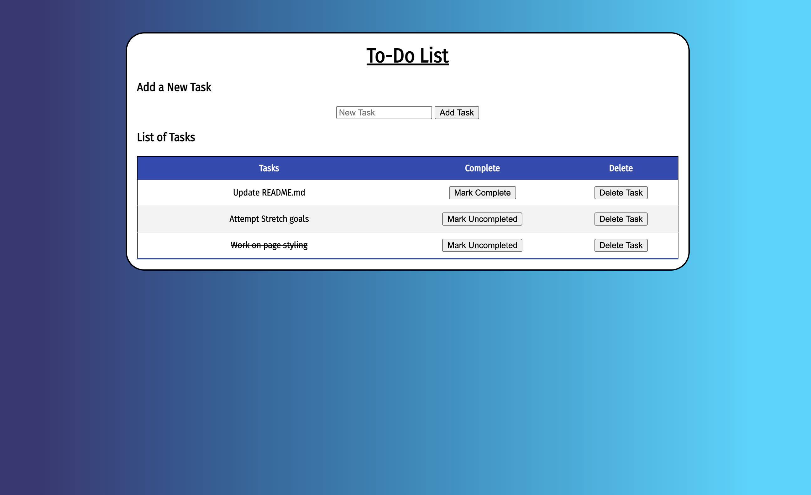

# To-Do List

## Description

_Duration: 1 Day Sprint_

This to-do list application is a convenient server-hosted tool that could help users quickly and easily add, manage, and delete tasks in a visually appealing fashion.

The to-do list allows users to input tasks (up to 120 characters per task) and: mark them complete, mark them not-complete, or delete them. The desired action is selected by clicking one of the buttons next to a task.

Clicking the 'Add Task' button stores the provided task information as an object and sends it to the server, from where it is routed to a SQL database. Information stored or modified in the database is displayed on the DOM.

Clicking the 'Mark Complete' button next to a task changes its checked status from 'false' to 'true'. On the DOM, the task is marked complete using a strike-through. Clicking the 'Mark Uncompleted' button changes the checked status of that task from 'true' to 'false', removing the strike-through on the DOM.

Clicking the 'Delete' button next to a task removes that task from the DOM and deletes it from the SQL database.

## Languages
- HTML
- Javascript (w/jQuery and node.js)
- CSS
- SQL

## Installation
1. The application is hosted on heroku. Access it at https://blooming-gorge-00487.herokuapp.com or continue using the steps below.
2. If desired, fork and clone this repository.
3. With node.js and npm installed, open this repository in terminal.
4. Use 'npm install' to install the required modules (Express and PostgreSQL/PG).
5. Start the server using 'npm start'.
6. Access 'localhost:5000/' in your favorite browser.

## Screenshots

## Checklist

## Acknowledgement

Many thanks to [Prime Digital Academy](https://www.primeacademy.io/?utm_campaign=brand_search&utm_medium=cpc&utm_source=google&utm_medium=ppc&utm_campaign=Brand+Search&utm_term=prime%20digital%20academy&utm_source=adwords&hsa_mt=e&hsa_kw=prime%20digital%20academy&hsa_grp=34455376016&hsa_tgt=kwd-292678835500&hsa_ad=209774192547&hsa_ver=3&hsa_acc=5885076177&hsa_cam=670836869&hsa_src=g&hsa_net=adwords&gclid=CjwKCAjw4KyJBhAbEiwAaAQbE9A9_CGO-PE_cgrfInn9Py0N73UJJ5vs_0BQomI6E13bOdA_c6EmkRoCJikQAvD_BwE), without whom this would not be possible.

## Support

Please contact me at anthonyvlynch5@gmail.com with any concerns, problems, or suggested improvements.
